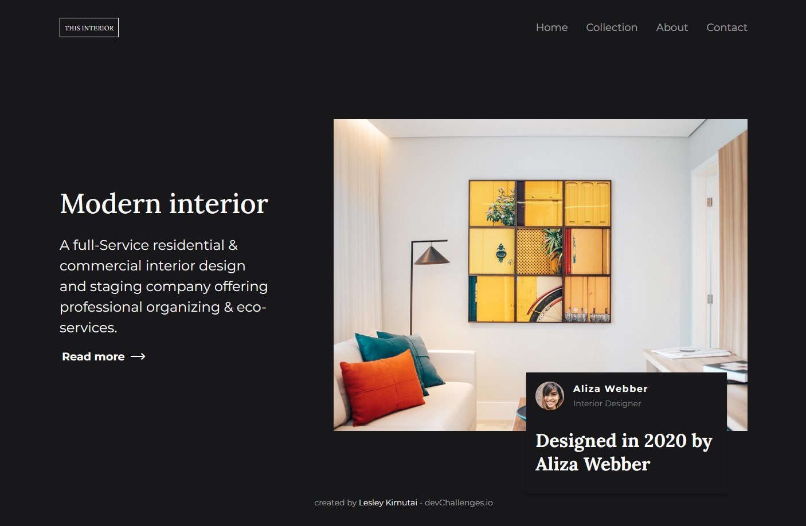
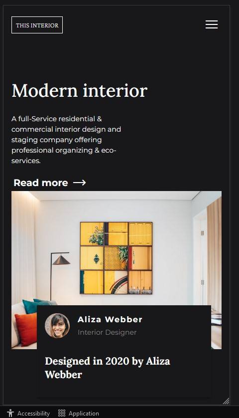

<!-- Please update value in the {}  -->

<h1 align="center">Interior Consultant</h1>

<div align="center">
   Solution for a challenge from  <a href="http://devchallenges.io" target="_blank">Devchallenges.io</a>.
</div>

<div align="center">
  <h3>
    <a href="https://issagoodlifeinc.github.io/interiorconsultant/">
      Demo
    </a>
    <span> | </span>
    <a href="https://github.com/issagoodlifeInc/interiorconsultant.git">
      Solution
    </a>
    <span> | </span>
    <a href="https://devchallenges.io/challenges/Jymh2b2FyebRTUljkNcb">
      Challenge
    </a>
  </h3>
</div>

<!-- TABLE OF CONTENTS -->

## Table of Contents

- [Table of Contents](#table-of-contents)
- [Overview](#overview)
  - [Built With](#built-with)
- [Features](#features)
- [Contact](#contact)

<!-- OVERVIEW -->

## Overview

- Laptop View of the mockup

- Mobile View of the mockup


Introduce your projects by taking a screenshot or a gif. Try to tell visitors a story about your project by answering:

- Loved working with google material icons 

### Built With

<!-- This section should list any major frameworks that you built your project using. Here are a few examples.-->

- HTML, CSS , JS 

- What I have learnt
  - Took a new approach to handling the navigation switching the material icon span innerhtml to get the nav to show up
  - Also used two media queries for the nav links to act as they shoul leaving the same x-tics on the boiler css 

-Code :- 
```css
@media screen and (width < 500px) {
  header nav .navs {
    display: none;
    place-content: center;
    flex-direction: column;
    z-index: 10;
    position: absolute;
    inset: 0 0 0 0;
    background-color: var(--black);
    transition: all 300ms ease-in;
  }

  .hamburger {
    z-index: 1000;
  }
}
@media screen and (width > 500px) {
  .hamburger {
    display: none;
  }
}
```

```js
hamburgerBtn.addEventListener("click", () => {
  // Change hamburger menue to close
  hamburgerBtn.innerHTML === "menu"
    ? (hamburgerBtn.innerHTML = "close")
    : (hamburgerBtn.innerHTML = "menu");

  // Show navigation links

  hamburgerBtn.innerHTML === "close"
    ? (navs.style.display = "flex")
    : (navs.style.display = "none");
});

```

## Features

<!-- List the features of your application or follow the template. Don't share the figma file here :) -->

This application/site was created as a submission to a [DevChallenges](https://devchallenges.io/challenges) challenge. The [challenge](https://devchallenges.io/challenges/Jymh2b2FyebRTUljkNcb) was to build an application to complete the given user stories.

## Contact

- Website [Lesley Kimutai](https://leskimfamily.herokuapp.com/lesley)
- GitHub [@Leskim](https://github.com/Leskim)
- Twitter [@LesleyKimutai](https://twitter.com/LesleyKimutai)
